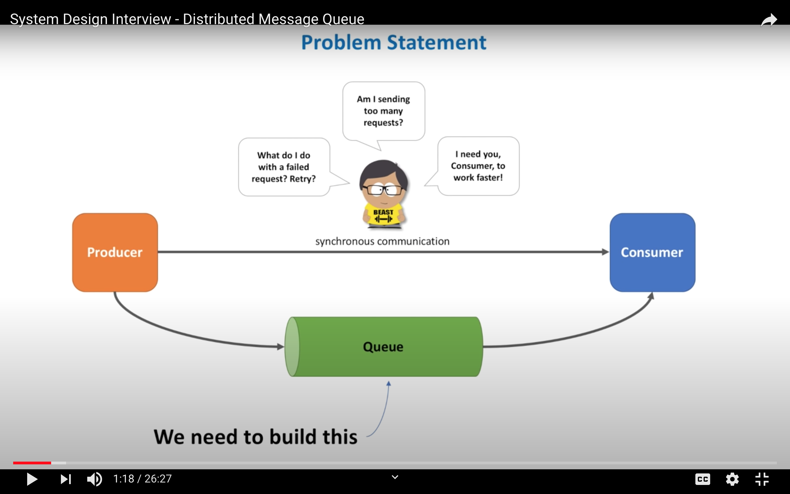
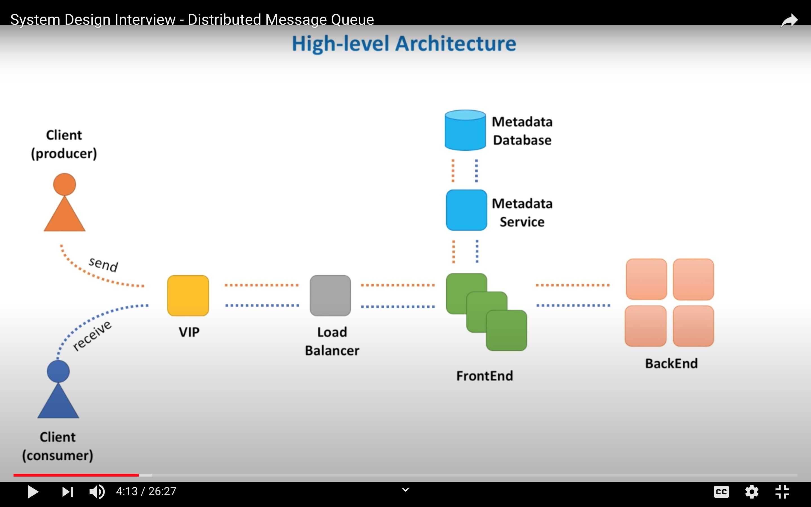
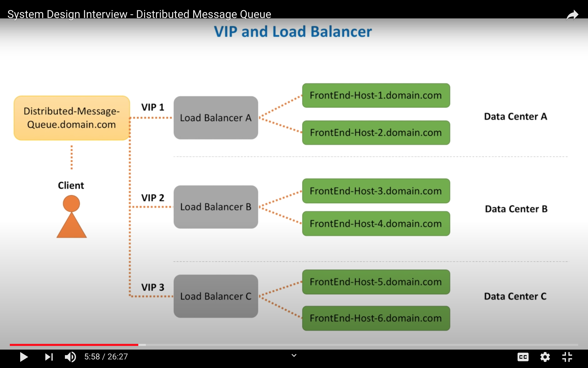
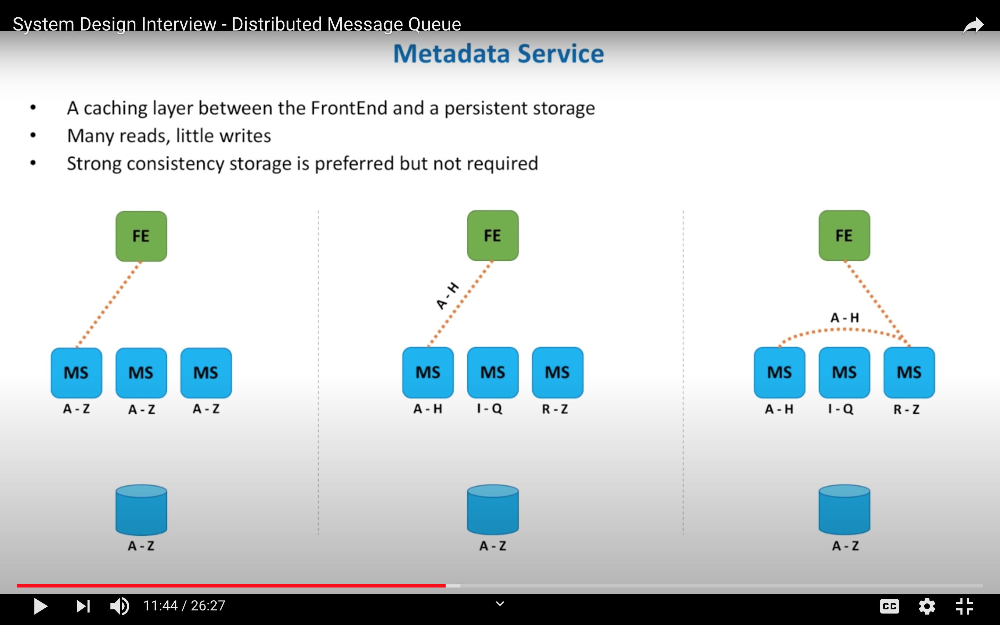
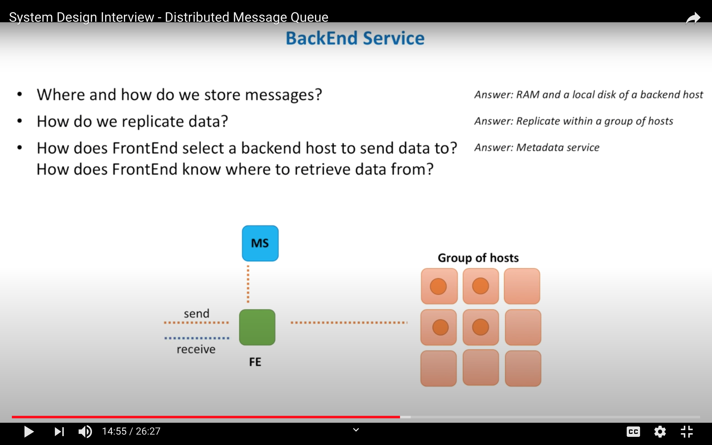
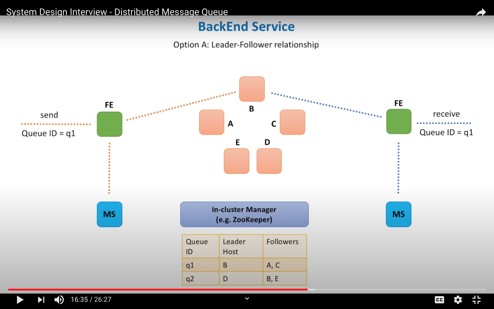
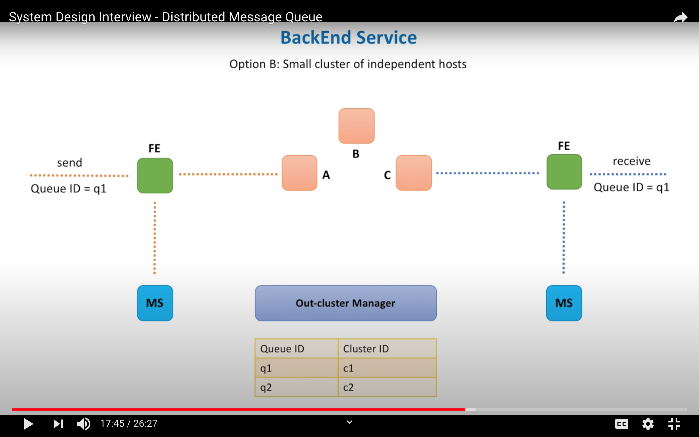
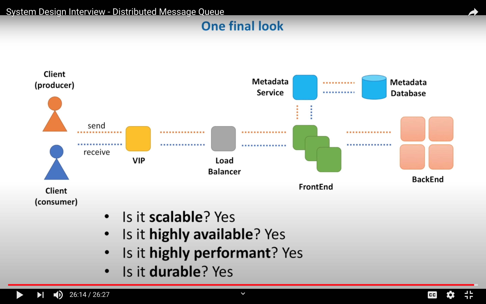

# systemdesign
System Design points to consider

# Distributed message queue

## Requirements

### Functional Requirements
`good place to add functional requirements`
- send_message(topic, body)
- receive_message(topic)

### Non functional requirements ( SLA - Service level agreements )
- Scalable - must handle load increase
- Highly Available - survives hardware fails and network partitioning
- Performant - single digit latency
- Durable - once submitted, data is not lost
- Extra
    - Maximum throughtput
    - Optimise costs

## Tradeofs

### Synchronous Communication
++ easy

++ faster to implement

-- hard to deal with errors

-- hard to deal with multiple requests

-- hard to deal with failing consumers

==> must have async communication

## High Level Design

## Components

### DNS and Load Balancer

TODO: Virtual IP Partitioning
DNS Resolves to load balancer

Load balancing techniques - Active - Passive Failover

To achieve DNS load balancing - Assign multiple A records to the same DNS name for the service

=> Requests are partitioned over several Load Balancers, over several Data Centers

=> Increase Availability

=> Increase Performance

### FrontEnd Service
- A lighweight web service
- Stateless service deployed across several data centers

#### Actions
- Request Validation
    - Ensure Required Parameters are present
    - Ensure data is not larger then permitted
    - Other Constraints

-  Authentication/Authorization
    - AUTHENTICATE -> Validate the identity of a user or a service
    - AUTHORIZE -> Determine whether or not the actor has permissions to do certain actions

- TLS(SSL) Termination
    - TLS -> Ensure data privacy and integrity
    - TLS Termination -> decrypt a request and pass unqncrypted request to the BackEnd
    - TODO: SSL on Load Balancer is Expensive
    - Termination usually handled by a TLS HTTP Proxy process that runs on the same host, not the FrontEnd service

- Server-side Encryption
    - Messages are encrypted as soon as FrontEnd receives them
    - Messages are stored in encrypted form and FrontEnd decrypts messages only when they are sent to the consumer

- Caching
    - Stores copies of source data
    - Helps reduce load on backend services
    - Increase overall system throutput and availability
    - Decrease latency
    - Stores metadata information about most used queues
    - Stores user identity information to save on calls to authentication services 

- Rate limiting (Throttling)
    - Limiting the number of requests per time unit
    - Protect the web service from being overwhelmed with requests
    - TODO: Leaky bucket algorithm

- Request dispatching
    - Responsible for all the activities associated with sending requests to backend services
        - Clients management
        - Response handling
        - Resources Isolation
    - TODO: Blukhead Pattern helps to isolate elements of application into pools so that if one fails, other will not be affected
    - TODO: Circuit Breaker pattern prevents an application from repeatedly trying to execute an operation that's likey to fail

- Request deduplication
    - May occur when a response from successful send_message request failed to reach a client
    - TODO: Lesser issue for 'At least once' delivery schematics, bigger issue for 'Exactly Once' or 'At most once' delivery semantics when we need to guarantee the message was processed at most once
    - Caching usually used to store previously seen request ids

- Usage data collection
    - Gather real-time information that can be used for audit

### Metadata Service

- A caching layer between FrontEnd and persistent storage
- Many Reads, little writes
- Strong consistency is prefered but not required
- provides separation of concerns
- simplifies maintenance and ability to make changes
- provides access through an well defined interface (API)

### BackEnd Service

- Where and How do we store messages ?
    - RAM and local disk of backend host

- How do we replicate data?
    - Replicate within a group of hosts

- How does FrontEnd select a backendhost to send data to?
- How does FrontEnd know where to retrieve data from?
    - Metadata Service

#### Option 1 -> Leader-Follower relationship

* all messages in queue go to this leader instance

##### On SEND
1. FrontEnd receives SEND with qid=1
2. FrontEnd calls Metadata Service to identify the BackEnd Leader Instance
3. Message is sent to the leader and leader is fully responsible for message duplication

##### On RECEIVE
1. FrontEnd receives RECEIVE message with qid=1
2. FrontEnd makes request to Metadata Service to identify leader of the queue
3. FrontEnd makes request to BackEnd to get the message
4. BackEnd Queue Leader is responsible for message cleanup

- Need component to choose leader election => In-Cluster Manager, e.g. ZooKeeper
    - Responsible for mapping between Queues, Leaders and Followers
    - Reliable, Scalable and Performant
    - Can we avoid Leader election?

#### Option 2 -> Small Cluster of independent hosts, All instances are equal

e.g. 3 clusters each with 3,4 Machines distributed across several datacenters

##### On SEND
1. FrontEnd receives SEND with qid=1
2. FrontEnd calls Metadata Service to identify the cluster where queue is stored
3. FrontEnd makes request to random instance in cluster
4. Called instance is responsible for data replication across all nodes in cluster

##### On RECEIVE
1. FrontEnd receives RECEIVE with qid=1
2. FrontEnd calls Metadat Service to identify the cluster where the queue is stored
3. FrontEnd makes request to random instance in cluster
4. Called instance resposible for data cleanup across all nodes in cluster
- No longer need component to choose leader election
- Need component to manage queue to cluster assignments => Out-Cluster Manager

| In-Cluster Management  | Out-Cluster Management |
| ---------------------- | ---------------------- |
| Manages queue assignment within the cluster  | Manages queue assignment among clusters  |
| Maintains a lists of hosts in the cluster  | Maintains a list of clusters  |
| Monitors heartbeats from hosts  | Monitors each cluster health  |
| Deals with leader and follower failuers | Deals with overheadted clusters  |
| Big Queues | Big Queues |
| Splits queue between cluster nodes (partitioning) | Splits queue between clusters |

### What else is important
- Queue creation and deletion
    - API
    - Carefull with deletion, maybe only CLI
- Message deletion
    - Do not delete right after consumation
    - Keep track of offset / Have cleaning job - Apache Kafka
    - Mark messages as invisible, they can not be seen. Client needs to call DeleteMessage. If message is not deleted, it will become visible again - Amazon SQS
- Message Replication -> Achieve Message durability
    - Syncronously
        - When backend host receives new message, it blocks the request untill all duplication is done
        - ++ Has high durability
        - -- Has high latency 
    - Async
        - Response returned as soon as message is stored on first host, replication is done afterwards
        - ++ Has low latency
        - -- Does not guarantee that message survives backend host failures
- Message Delivery Semantics
    - At least once
        - Messages are never lost and can be redelivered
        - Basically the way to go
    - At most once
        - Messages can be lost and are never redelivered
    - Exactly once
        - Message delivered once and exactly once
        - Harder to implement because of failures to deliver, replication fail, consumers may fail to retrieve the message
- Push VS Pull
    - Pull easier to implement
- FIFO
    - Oldest message always processed first
    - Hard to maintain a certain order
- Security
    - Messages are encrypted over SSL/TLS to protect messages in transit
    - Encrypt messages on backend host
- Monitoring
    - Monitor components
    - Provide visibility into customer experience
    - Monitor health of queue system
    - Emit metrics and log data
    - setup alerts
    - customers can setup dashboards

### SLA Reevaluation

- Scalable
    - Yes, all components are scalable, when load increases -> scale horizontally
- Highly Available
    - Yes, no single points of failures
    - Components deployed over several data centers
    - Individual hosts may die, partitions can happen
- Performant
    - Depends on implementation, hardware, network setup
- Durable
    - Replicate data while storing
    - Messages are not lost

