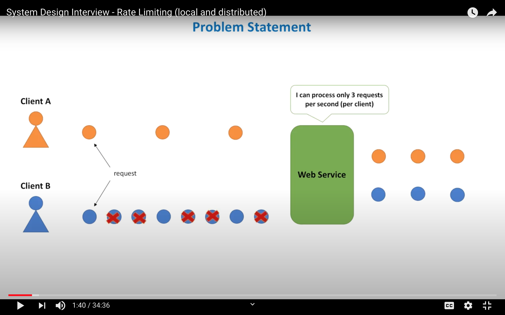
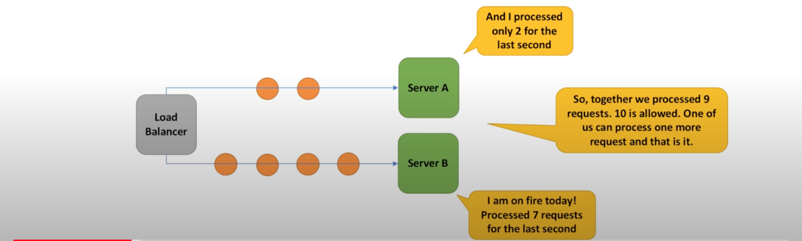
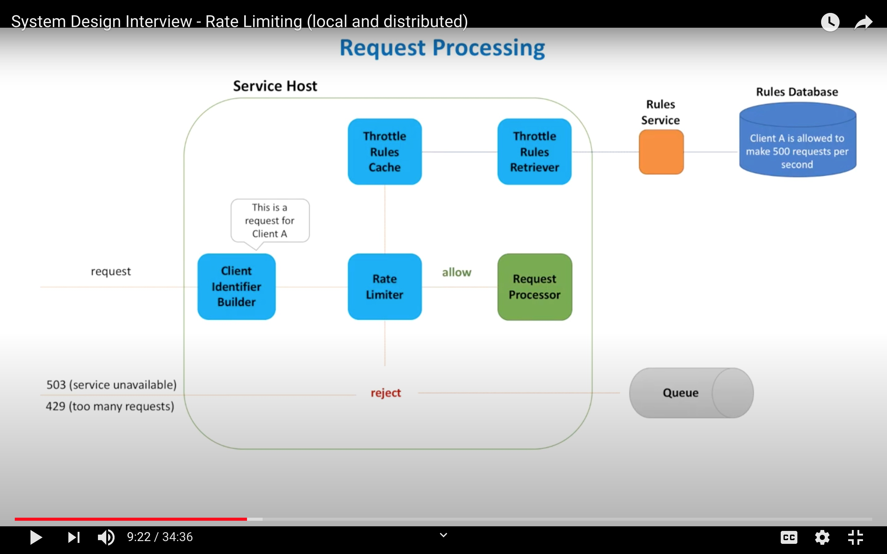
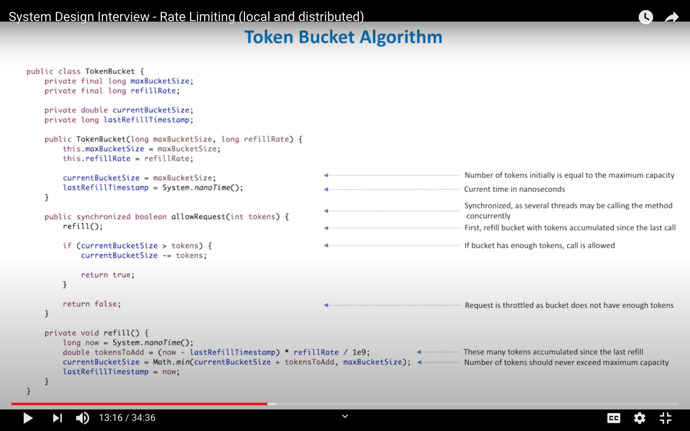
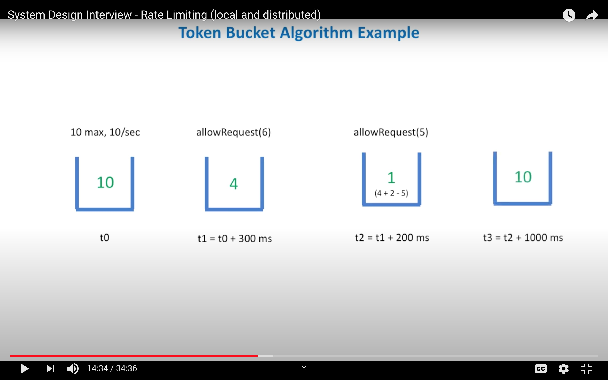

# Rate Limiter

## Questions

- Do we not need to write a software that scales to handle high load?
    - ideally yes, but not immediately. Scaling takes time and by the time all the other machines are up, our service may already crash

- We already have max connections in the Load Balancer and Max Threads count in the Service Endpoint. Is throttling still necessary?
    - Load Balancer can set a limit on simultaneous requests or can send a request in a queue. But this mechanism is for all services. We may want to throttle only certain services ( e.g. Throttle slow operations)

- What if we throttle each host individually?
    - Will not work because traffic in not evenly distributed over all hosts. Some hosts may have more requests, some hosts may have less. We need to find a way for hosts to communicate with each other and share request information.

## Requirements

## Functional Requirements
- allowRequest(request)

## Non-Functional
- Fast/Low Latency ( make decision as soon as possible )
- Accurate ( as accurate as we can get )
- Scalable ( Supports an arbitrarily large number of hosts in the cluster, rate limiter scales out together with the service itself )
- If a decision can not be made => do not throttle

## High level Architecture

- Throttle Rules Retriever
    - each rule specifies max number of requests per client per time unit
    - poll for rules periodically
    - uses Rules service, which stores the rules in a database
    - updates Throttle Rules Cache

- Throttle Rules Cache
    - stores each rule in memory for fast access

- Client Identifier
    - login for registered clients
    - remote ip address
    - combination of other attributes to identify clients

- Rate Limiter
    - after the client is identified, checks the Throttle Rules Cache to see if limit must be applied
    - resposible for making Throttle decision
    - if threshhold is not exceeded: request is forwarded to Request Processor
    - if threshhold is exceeded:
        - reject request:
            - return 503: Service Unavailable
            - return 429: Too many requests
            - queue request for later processsing
            - drop request
    
### Other important ideas
- we need a database to store the rules
- we need a service on top of database for CRUD operations on rules
- we need a process to retrieve rules periodically and store them in cache
- we need a component to make the decision
- is it necessary to have the client identifier as a separate component? can it be part of the rate limiter component? ( Yes, but remember that client identification is an important part of the process )

### Possible directions
- rate limiting algorithm ( Token bucket )
- object oriented design ( define classes and interfaces )
- focus on distributed throttling solution, how hosts share data between each other

## Rate limiter algorithm - Token Bucket

- analogy with bucket filled with tokens
- bucket:
    - has maximum capacity ( MaxTokens )
    - knows how many tokens are in the bucket ( CurrentTokens )
    - tokens refilled at constant rate ( RefillRate )

- everytime a request comes, a token is taken from the bucket
    - if bucket has no tokens => reject request

- bucket:
    - max 10 tokens
    - 10 available tokens
    - refill rate 10 tokens/sec

- at t0:
    - 10 available tokens

- at t1 = t0 + 300ms:
    - called allowRequest(6):
        - bucket was full, substract 6 from 10 available tokens => 4 tokens remaining

- at t2 = t1 + 200ms
    - called allowRequest(5):
        - bucket had 4 tokens, refill bucket with 2 tokens because 200ms passed since last request
        - substract 5 from 6 available tokens => 1 token remaining

